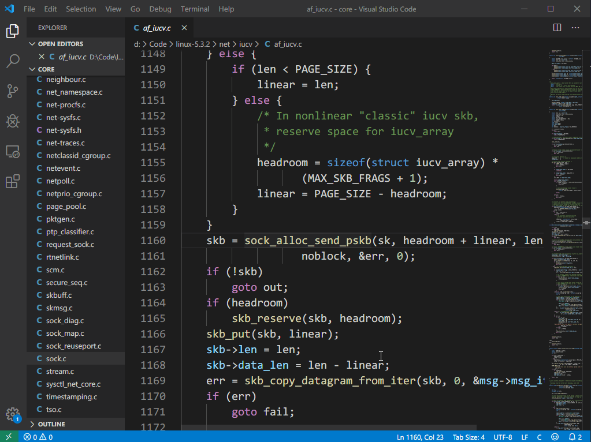
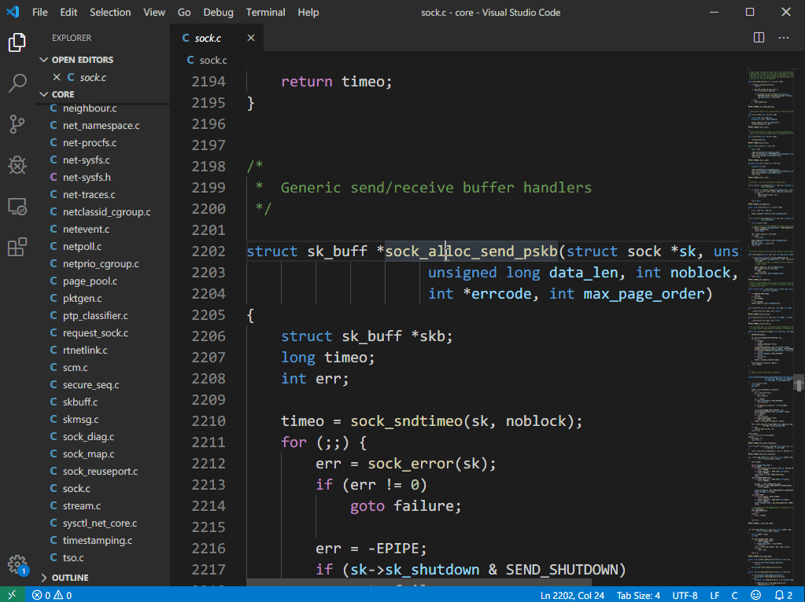
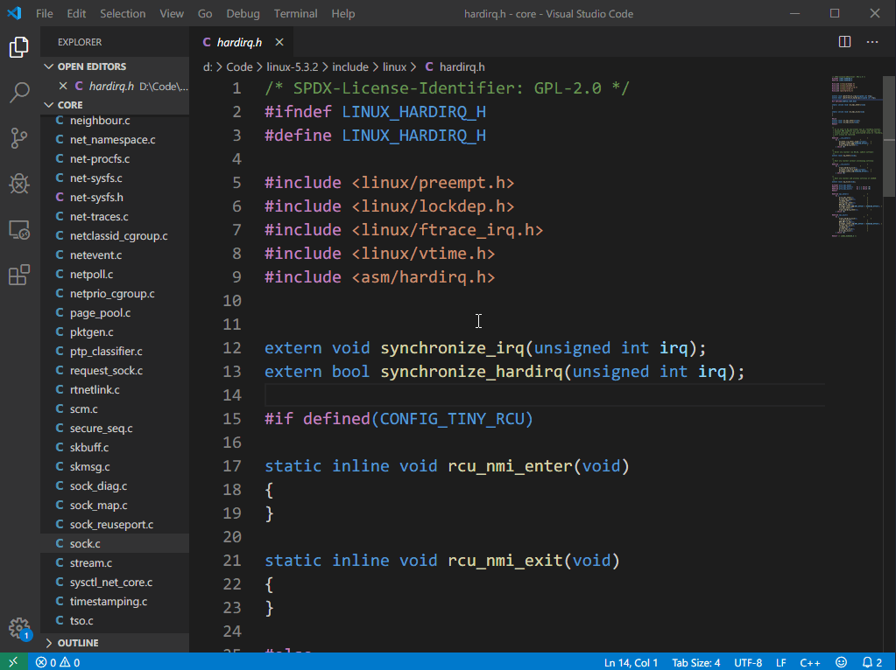
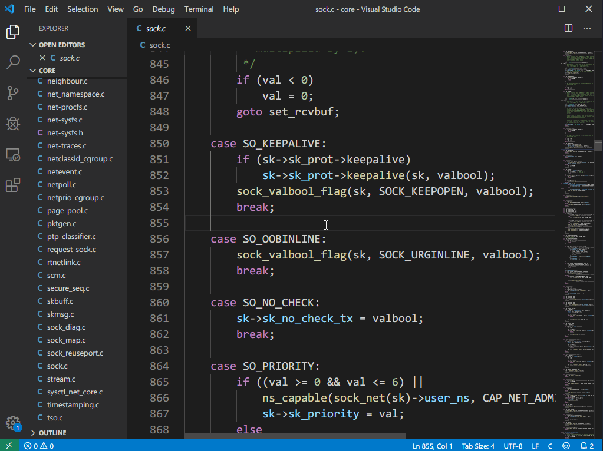
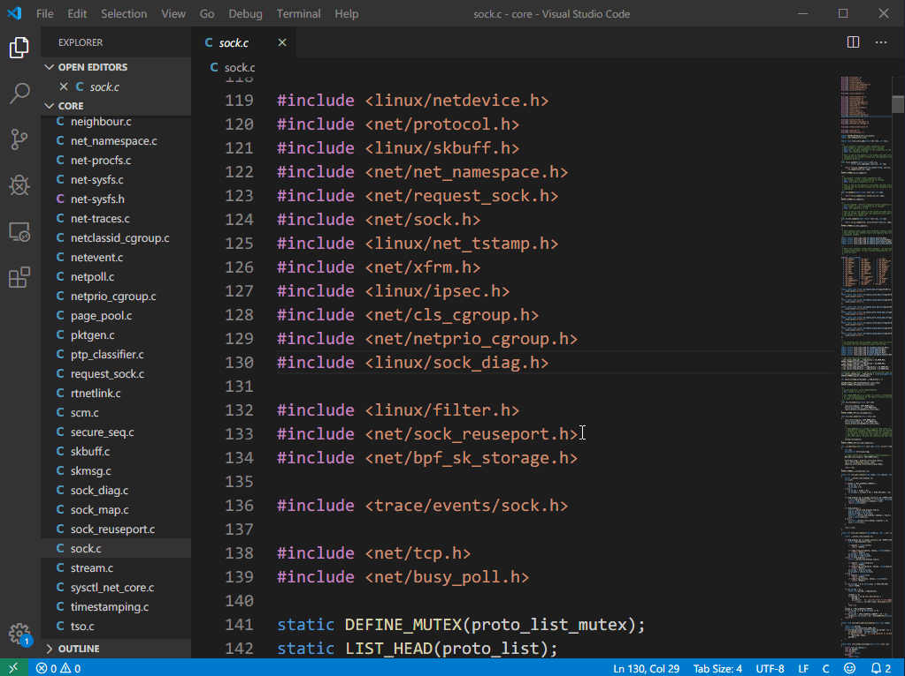

# CodeJumper README

[English Docs](https://github.com/knightjun/VSCode-C-CPP-CodeJumper/blob/master/README.md) | [中文文档](https://github.com/knightjun/VSCode-C-CPP-CodeJumper/blob/master/README_CN.md)

CodeJumper is a VSCode plugin based on [GNU Global] (https://www.gnu.org/software/global/). It is used to find symbol definitions, references, jump files, auto-completion, etc. in C/C++ projects. If the large project is opened in VSCode, it will cause a freeze. This extension can retrieve the symbol of the entire project when one of the modules open, and the speed is very fast.

> This extension is recommended for large C/C ++ projects, and small projects are recommended to use [C/C++ Extension](https://marketplace.visualstudio.com/items?itemName=ms-vscode.cpptools)

## Usage

The extension is based on[GNU Global](https://www.gnu.org/software/global/)，You need to install GUN Global first, execute the `gtags` command in the project root directory to produce a TAG file, and then you can use VSCode to open any module of the project to retrieve the symbols of the entire project.

> Note: The TAG file is not updated in real time. If the source file is changed after the TAG file generated, it may cause positioning errors. You need to re-execute the gtags command in the root directory to generate the TAG file again. Or execute the `global -u` command in the changed source directory to update the TAG file

## Features

* Find symbol definitions
  

* Find symbol references
  

* Search project files

* Search symbol
  

* Jump header

> The features of retrieving symbols, retrieving project files, and jumping header files can be set as right-click menu in the settings

## Extended Settings

* `CodeJumper.globalPath`：The default is empty, set the path of the global program, if the path where the global is set is added to the environment variable, it can be empty.
* `CodeJumper.CompletionItem`：Enable by default, If it freezes during auto-completion, you can turn it off.
* `CodeJumper.SearchFileInMenu`：Disabled by default, show command to retrieve files in right-click menu.
* `CodeJumper.SearchSymbolInMenu`：Disabled by default, show search symbol command in right-click menu.
* `CodeJumper.JumpToHeaderFileInMenu`：Disabled by default, show jump to header command in right-click menu.

## Known Issues

* Spaces in the project path may cause exceptions
* Only tested under windows

## Release Notes

### 0.0.1

Initial Release

