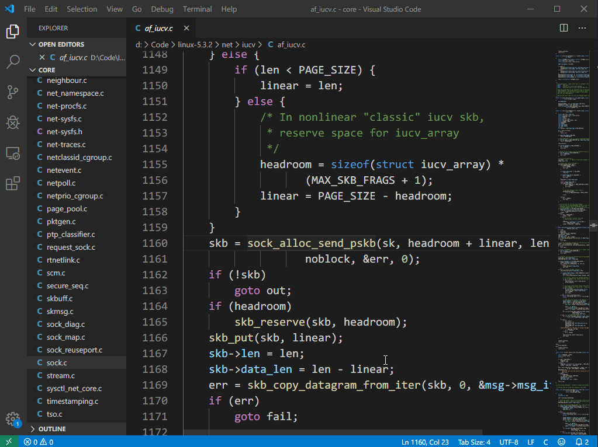
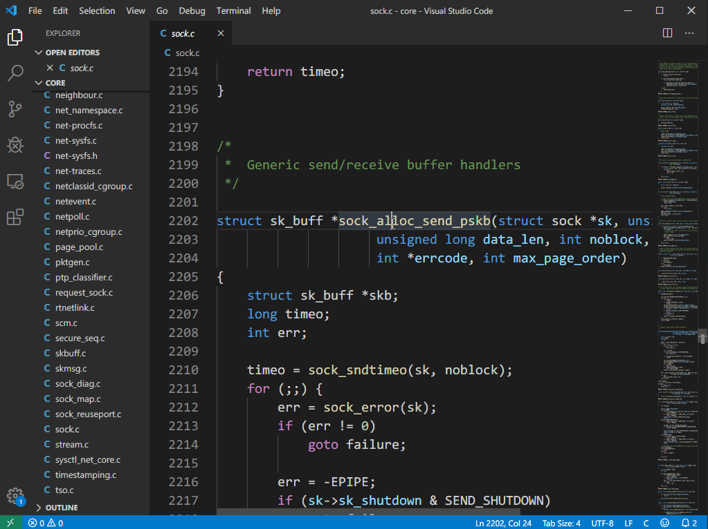
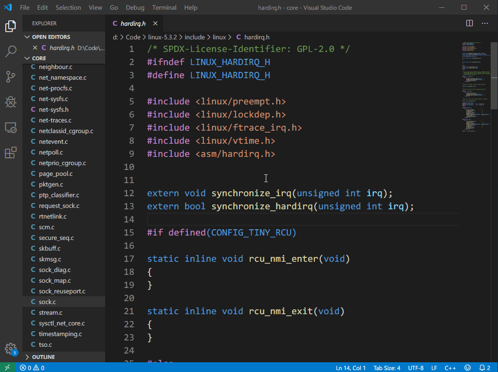
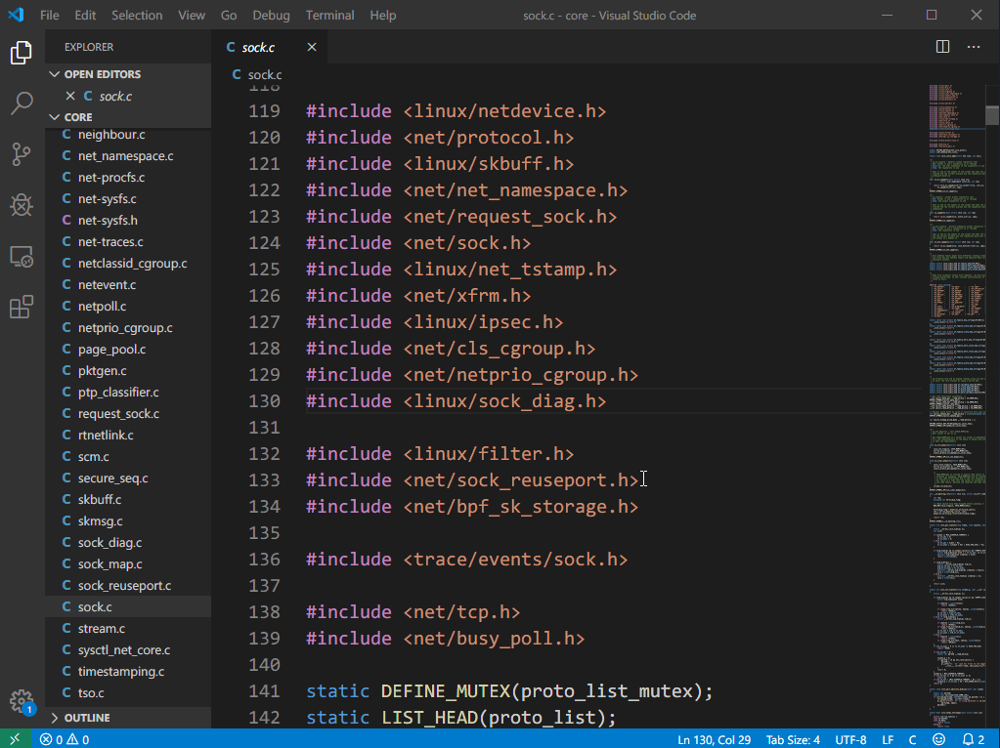

# CodeJumper README
[English Docs](https://github.com/microsoft/vscode-cpptools/blob/master/README.md) | [中文文档](https://github.com/microsoft/vscode-cpptools/blob/master/README_CN.md)

CodeJumper是基于[GNU Global](https://www.gnu.org/software/global/)的VSCode插件，用于在C/C++项目查找符号定义，引用，跳转文件，自动补全等。在大型项目中，如果打开整个项目会导致卡顿，此扩展可以在打开其中一个模块的情况下检索整个项目的符号，检索速度飞快。

> 该扩展建议用于大型C/C++项目，小型项目建议使用[C/C++插件](https://marketplace.visualstudio.com/items?itemName=ms-vscode.cpptools)

## 使用说明

该插件基于[GNU Global](https://www.gnu.org/software/global/)，需要先安装GUN Global，在项目根目录下执行`  gtags  `命令生产TAG文件，然后可以用VSCode打开项目的任意一个模块，可检索整个项目的符号。

> 注意，TAG文件不会实时更新，如果源码文件在TAG文件生成后有更改，可能会导致定位错误，需要重新在根目录执行gtags命令重新生成TAG文件。或在更改的源码目录中执行`global -u`命令更新TAG文件

## 功能列表

* 查找符号定义
  

* 查找符号引用
  

* 检索项目文件

* 检索符号
  

* 跳转头文件

> 检索符号，检索项目文件，跳转头文件的功能可在设置中设置为右键菜单

## 扩展设置项

* `CodeJumper.globalPath`：默认为空，设置global程序的路径，如果把global所在路径设置加入环境变量，则此处可为空
* `CodeJumper.CompletionItem`：默认开启，是否开启自动补全。若是自动补全时卡顿，可将其关闭
* `CodeJumper.SearchFileInMenu`：默认关闭，在右键菜单中显示检索文件命令
* `CodeJumper.SearchSymbolInMenu`：默认关闭，在右键菜单中显示检索符号命令
* `CodeJumper.JumpToHeaderFileInMenu`：默认关闭，在右键菜单中显示跳转到头文件命令

## 已知问题

* 项目路径中有空格可能会导致异常
* 只在windows下测试过

## 发布记录

### 0.0.1

首次发布

